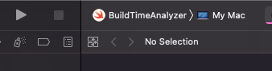
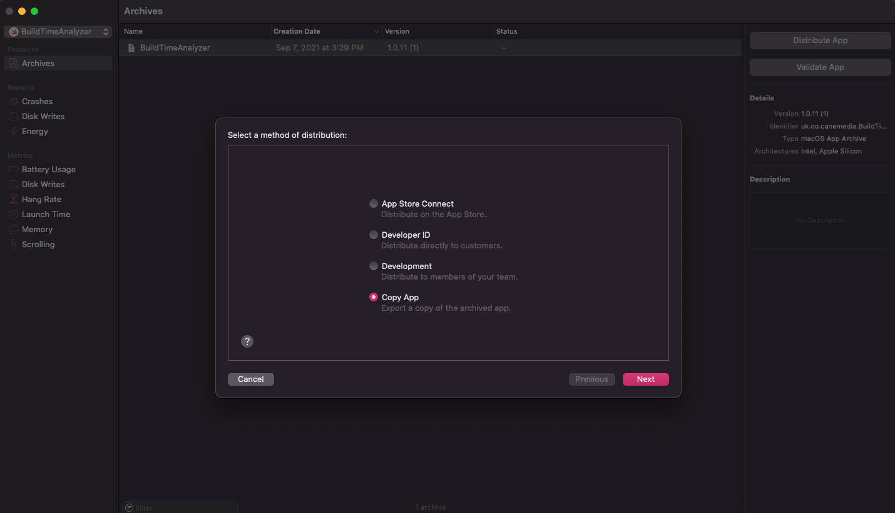
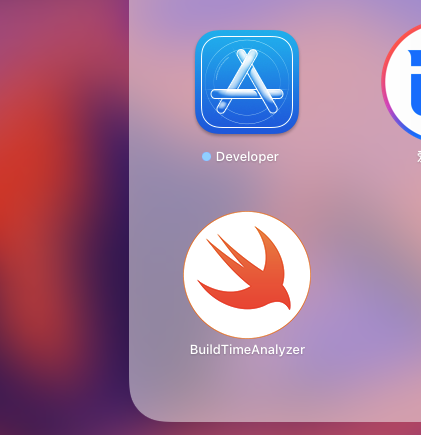
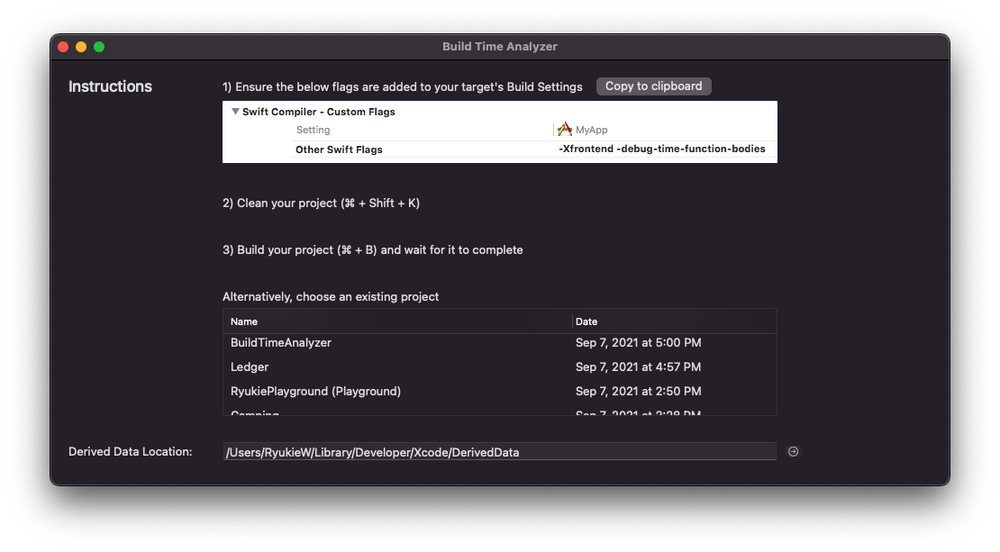
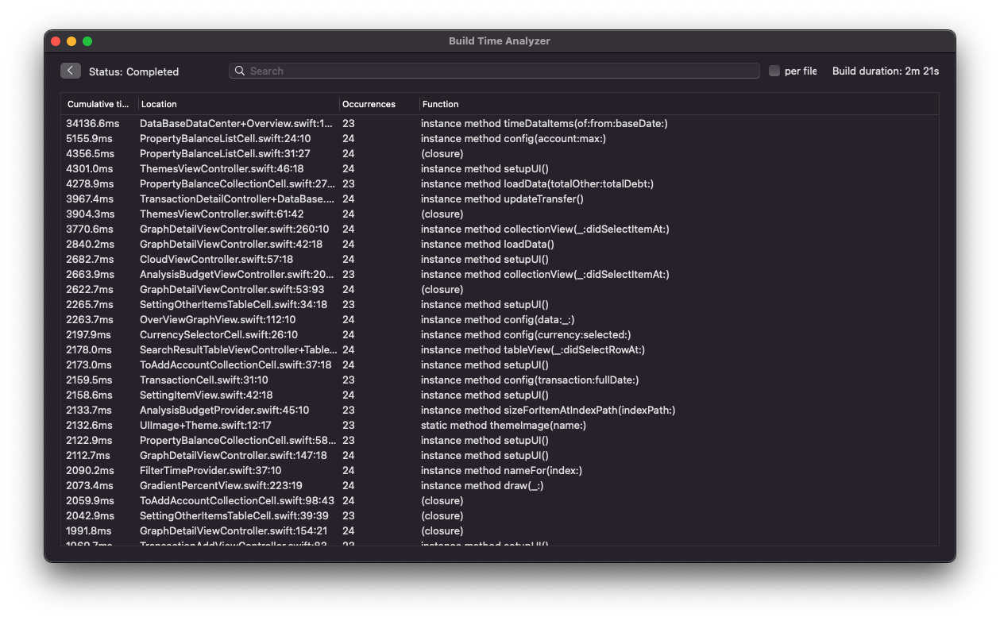

Build Time Analyzer for Xcode 中文使用手册
======================

[](https://github.com/RobertGummesson/BuildTimeAnalyzer-for-Xcode/releases/latest)
[](https://swift.org)
[](https://github.com/RobertGummesson/BuildTimeAnalyzer-for-Xcode)
[](https://opensource.org/licenses/MIT)

[原ReadMe](README-EN.md)
# 使用说明

首先 Clone 项目代码（或者直接下载代码）

```
git clone https://github.com/RyukieSama/BuildTimeAnalyzer-for-Xcode.git
```

## 一、 项目配置

在 `BuildSettings` 中 `other swift flags` 下添加下面的配置：

* -Xfrontend -debug-time-function-bodies

然后 `Clean` 项目，重新 `Build`。

## 二、 打开 BuildTimeAnalyzer.xcodeproj

这里有两种方式来使用

### 1. 直接运行



### 2. 导出App

`Product - Archive`



导出一个App文件，以后即可直接使用了。



### 3. 懒人方式-下载即用

这里我搞好了一个包，直接可用。支持 `Intel`， `Apple Silicon`。

[BuildTimeAnalyzer.zip](BuildTimeAnalyzer.zip)

## 三、 查看日志



在列表中点击刚才自己的配置完成并编译后的项目，即可查看日志。



显示了整体编译耗时，还标有具体代码的行数与函数名，点击可跳转。